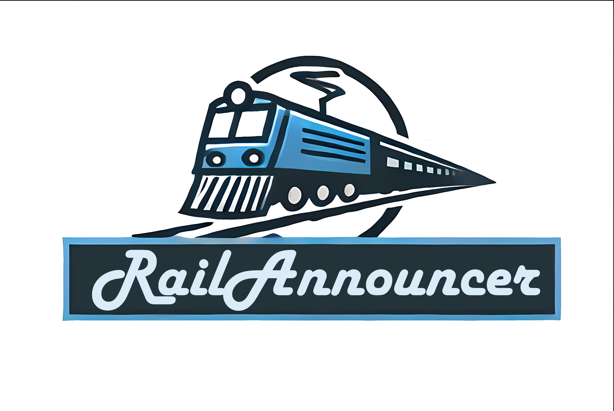

# Rail Announcer

Rail Announcer ist ein Python-Programm mit einer grafischen Benutzeroberfläche (GUI), das Text-to-Speech-Ansagen für einen Zugsimulator abspielt. Das Programm verwendet `gtts` für die Text-to-Speech-Funktionalität und `tkinter` für die GUI.

## Inhaltsverzeichnis

- [Installation](#installation)
- [Verwendung](#verwendung)
- [Dateistruktur](#dateistruktur)
- [Screenshots](#screenshots)
- [Contributing](#contributing)
- [Lizenz](#lizenz)

## Installation

### Voraussetzungen

- Python 3.12.4 oder höher
- pip (Python package installer)

### Benötigte Pakete

Installiere die benötigten Pakete mit pip:

```bash
pip install gtts pygame
```

## Verwendung

1. Starte das Programm:

    ```bash
    python main.py
    ```

2. Wähle eine Strecke und einen Zugdienst aus den Dropdown-Menüs.
3. Klicke auf "Nächste Station" oder "Vorherige Station", um durch die Stationen zu navigieren.
4. Die aktuelle und nächste Station werden angezeigt.
5. Die Ansagen werden als "Nächster Halt Next Stop: <Stationsname>" abgespielt.
6. Wenn die letzte Station erreicht ist, wird automatisch die Ansage "Dieser Zug endet hier. Bitte aussteigen. Vielen Dank, dass Sie mit uns gereist sind." abgespielt.

## Dateistruktur

Stelle sicher, dass deine Ordner- und Dateistruktur wie folgt aussieht:

```
Routen/
├── Strecke1/
│   ├── Zugdienst1.txt
│   ├── Zugdienst2.txt
├── Strecke2/
│   ├── Zugdienst1.txt
│   ├── Zugdienst2.txt
```

Jede `.txt`-Datei sollte eine Liste von Bahnhofsname enthalten, wobei jeder Name in einer neuen Zeile steht. Siehe Beispiel Routen.

## Screenshots


## Contributing

Beiträge sind willkommen! Bitte eröffne ein Issue, um Fehler zu melden, neue Features zu diskutieren oder neue Strecken anzulegen.
